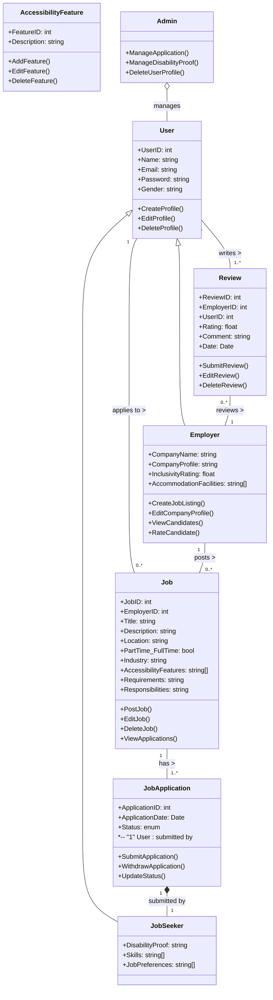

# IncluWork — Object Model

## Class Diagram

## Entities

| Entity | Description | Key Attributes |
|--------|-------------|----------------|
| **User** | Base entity for all platform users | UserID, Name, Email, Password, Gender |
| **JobSeeker** | Extends User; represents a differently abled job seeker | DisabilityProof, Skills, JobPreferences |
| **Employer** | Extends User; represents a company on the platform | CompanyName, CompanyProfile, InclusivityRating, AccommodationFacilities |
| **Job** | A job listing posted by an Employer | JobID, EmployerID, Title, Location, AccessibilityFeatures, Requirements |
| **JobApplication** | An application submitted by a JobSeeker for a Job | ApplicationID, ApplicationDate, Status |
| **Review** | A review written by a user for an Employer | ReviewID, Rating, Comment, Date |
| **AccessibilityFeature** | An accessibility accommodation associated with a Job | FeatureID, Description |
| **Admin** | Platform administrator managing users and applications | — |

## Relationships

| Relationship | Type | Cardinality | Description |
|--------------|------|-------------|-------------|
| User → JobSeeker / Employer | Inheritance (`<\|--`) | 1-to-1 | A User is either a JobSeeker or an Employer |
| User → Job | Association (`--`) | 1-to-many | A JobSeeker can apply to multiple Jobs |
| Employer → Job | Association (`--`) | 1-to-many | An Employer can post multiple Jobs |
| Job → JobApplication | Association (`--`) | 1-to-many | A Job can have multiple applications |
| JobApplication → JobSeeker | Composition (`*--`) | 1-to-1 | An application is tied to exactly one JobSeeker; it cannot exist without one |
| User → Review | Association (`--`) | 1-to-many | A User can write multiple Reviews for Employers |
| Review → Employer | Association (`--`) | many-to-1 | An Employer can receive multiple Reviews |
| Admin → User | Aggregation (`o--`) | 1-to-many | An Admin manages all Users |
